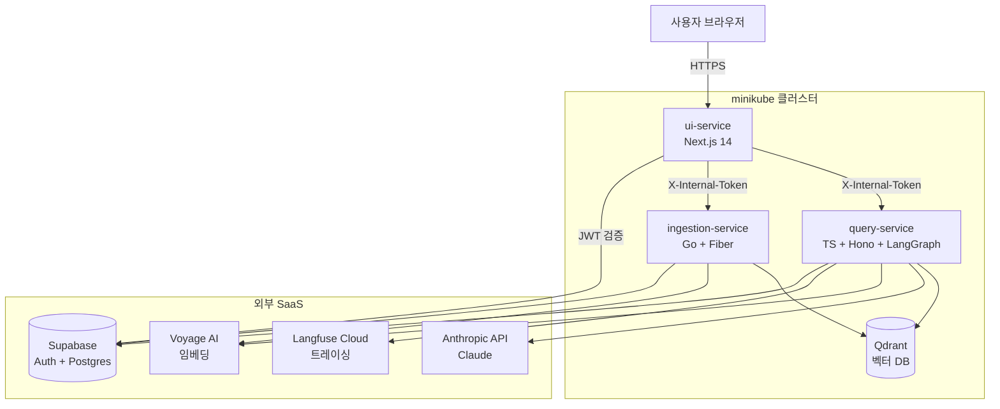

# 아키텍처 문서

**마지막 업데이트:** 2026-04-18

---

## 시스템 구성도



ui-service가 유일한 외부 진입점. 내부 서비스는 X-Internal-Token으로만 접근 가능.

---

## 서비스별 역할

### ingestion-service (Go 1.23 + Fiber v2)

**책임:** PDF 업로드 → 파싱 → 청킹 → 임베딩 → Qdrant + Supabase 저장

**엔드포인트**
- `POST /ingest` — 파일 업로드, jobId 반환
- `GET /ingest/status/{jobId}` — 진행 상태 폴링
- `GET /health` — 헬스체크 (인증 면제)

**주요 의존성**
- `github.com/dslipak/pdf` — PDF 파싱
- `github.com/gofiber/fiber/v2` — HTTP 프레임워크
- Voyage AI — 임베딩 생성
- Qdrant REST API — 벡터 저장
- Supabase Postgres — 문서 메타 저장, document_id 생성

**처리 흐름**
1. multipart 업로드 수신 → jobId 발급
2. Supabase `documents` INSERT (409 시 중복으로 처리)
3. PDF 텍스트 추출
4. 슬라이딩 윈도우 청킹 (512 tokens, 50 overlap)
5. Voyage API → 임베딩 배치 생성
6. Qdrant upsert (payload: `user_id`, `document_id`, `clause_no`, `page`, `doc_name`, `text`)
7. Supabase `documents.status` → `ready` (실패 시 `failed`)

### query-service (TypeScript 5 + Hono + LangGraph.js)

**책임:** 사용자 질문 → self-correction 루프 → 답변 + 근거 조항

**엔드포인트**
- `POST /query` — 질문 처리, 202 + jobId 반환 (비동기)
- `GET /query/stream/:jobId` — SSE 진행 상태 단방향 push (`Content-Type: text/event-stream`)
- `GET /health` — 헬스체크 (인증 면제)

**LangGraph 구조**
```
supervisor → retrieval_team → answer_team → grader
                ↑                              ↓ (점수<2, retry<2)
                └── query_rewriter ←───────────┘
                                               ↓ (pass)
                                              END

retrieval_team (subgraph):  retriever → (cond: claim_eligibility) tools_agent → END
answer_team (subgraph):     answer_generator → citation_formatter → END
```

**주요 의존성**
- `@langchain/langgraph` — 그래프 런타임
- `@anthropic-ai/sdk` — Claude (Sonnet: answer, Haiku: grader/rewriter)
- `langfuse` — 트레이싱 (각 노드 span)
- Qdrant REST API — 벡터 검색 + payload 필터
- Supabase — 채팅 히스토리 저장

**AgentState**
- `retryCount` — self-correction 재시도 횟수
- `gradingScore` — 1~3 채점 결과
- `document_id` — 약관별 격리용

### ui-service (Next.js 14 + Tailwind)

**책임:** 랜딩, 대시보드, API 라우트 프록시

**라우팅**
- `/` — 랜딩 (비로그인 공개)
- `/dashboard` — 3분할 채팅 UI (로그인 필요)
- `/login`, `/privacy`, `/terms` — 정적 페이지
- `/api/ingest`, `/api/ingest/status/[jobId]`, `/api/query`, `/api/query/stream/[jobId]` — 백엔드 프록시 (쿼리 진행 상태는 SSE passthrough)

**주요 의존성**
- `@supabase/supabase-js` — Auth + DB
- Google AdSense — CitationPanel 하단 광고

**상태 관리:** React Context (`AppContext`) 단일 인스턴스

---

## 인증 흐름

### Edge — Supabase JWT 검증

ui-service가 유일한 진입점. Supabase Auth(Google OAuth)의 JWT를 검증한다. 로그인 리다이렉트는 호스트 헤더 기반으로 처리 (0.0.0.0 회피).

### Internal — X-Internal-Token (Shared Secret)

ui-service → 백엔드 서비스 호출 시 `X-Internal-Token` 헤더 동봉.

**구현**
- ingestion-service: `app.Use(authMiddleware)` — Go Fiber
- query-service: `app.use("*", authMiddleware)` — Hono
- `/health`는 예외
- 검증 실패 시 `403 Forbidden`

**Why:** 내부 서비스가 직접 외부 공격에 노출되지 않도록 격리.

---

## 데이터 모델

### Qdrant

- Collection: `insurance_clauses`
- Vector: Voyage voyage-2 (1024차원)
- Payload: `user_id`, `document_id`, `clause_no`, `page`, `doc_name`, `text`
- Payload Index: `user_id`, `document_id` (검색 성능 최적화)

### Supabase (Postgres)

- `documents` — 사용자별 문서 메타 (id=UUID, user_id, name, status, created_at)
- `chat_messages` — 약관별 채팅 히스토리 (document_id, user_id, role, content, created_at)
- `citations` — 근거 조항 영속 저장

---

## 주요 설계 결정 이력

### PDF 파싱: `github.com/dslipak/pdf`
**When:** Phase 0
**Why:** `ledongthuc/pdf`는 Go 1.24+ 필요하지만 프로젝트는 Go 1.23 고정.

### 진행 상황 전달: Polling 방식 (1초 간격)
**When:** Phase 0 (ingestion), Phase 3에서 쿼리도 동일 패턴 적용 (2026-04-17)
**Why:** SSE/WebSocket보다 구현 단순. 개인 포트폴리오 규모엔 충분. ingestion/query 모두 동일 패턴으로 일관성 유지.
**업데이트 (2026-04-18):** 쿼리만 SSE로 전환. 아래 "쿼리 진행 상태 전송 — SSE" 항목 참조.

### 쿼리 진행 상태 전송 — SSE
**When:** 2026-04-18
**선택:** Server-Sent Events (단방향, 브라우저 EventSource 표준)
**Why:**
- 폴링은 30초 쿼리 = 30회 HTTP 왕복으로 Railway 대역폭/CPU 낭비
- SSE는 단방향 push에 표준 부합 + 1회 연결로 충분, WebSocket은 양방향이라 오버스펙
- 단계 라벨이 즉시 push되므로 폴링 1초 지연이 사라져 UX가 체감상 반응적으로 개선
**구성:**
- query-service: `JobRegistry.subscribe()` (EventEmitter), Hono `stream()` 핸들러 + 10초 heartbeat
- ui-service: Next.js streaming Response + TransformStream으로 프록시 (패스스루) + 완료 시 assistant 저장 (`markAssistantSaved` dedup + 실패 시 `resetAssistantSaved`로 재시도 경로 확보)
- ChatPanel: 브라우저 표준 `EventSource` + `cleanCloseRef` 가드로 close-initiated onerror 오탐 방지 + 60초 timeout
- eval runner: Node native fetch + ReadableStream 수동 SSE 파서 (Node에 EventSource 없음)
**제약:**
- query-service replica=1 전제 (multi-replica 시 pub/sub broker 필요)
- ui-service replica=1 전제 (`markAssistantSaved` in-memory dedup)
**영향 파일:** `query-service/src/jobs/query-jobs.ts`, `query-service/src/sse/format.ts`, `query-service/src/index.ts`, `query-service/src/eval/runner.ts`, `ui-service/app/api/query/stream/[jobId]/route.ts`, `ui-service/app/components/ChatPanel.tsx`
**상세 스펙:** `docs/superpowers/specs/2026-04-17-query-sse.md`

### 쿼리 비동기화: POST 202 + jobId + /status 폴링
**When:** 2026-04-17
**Why:**
- HTTP 동기 쿼리는 5~15초 블로킹 → 사용자 재전송 시 Anthropic 비용 폭증 위험
- 비동기 + 폴링으로 전환해 클라이언트가 진행 상태 수신 + 중복 방지 용이
- 서버 측: in-memory JobRegistry (replica=1 전제, TTL 5분)로 Supabase 히트 없이 경량
- 클라이언트 측: 버튼 disabled + 서버 409 + 기존 jobId로 폴링 복귀 이중 가드
- LangGraph `graph.stream({streamMode: "updates"})`로 노드 단위 진행 추적, questionType에 따라 totalSteps 동적 결정 (5 or 6)

### 진행 상태 UI: QueryProgress (ProgressBar 스타일)
**When:** 2026-04-17
**Why:**
- "약관 분석 중..." 정적 스피너는 15초 대기 중 불안 유발
- supervisor(구 classifier) 완료 후 totalSteps가 결정되므로, 그 전까지는 indeterminate 바로 표시
- 재시도(rewriter→retriever 루프)에도 progressIndex는 역주행하지 않음 (Max 유지), label만 변경
**영향 파일:** `query-service/src/jobs/query-jobs.ts`, `query-service/src/graph/stream.ts`, `query-service/src/jobs/step-labels.ts`, `ui-service/app/components/QueryProgress.tsx`, `ChatPanel.tsx`

### Qdrant: REST API (gRPC 아님, 포트 6333)
**When:** Phase 0
**Why:** Go 클라이언트 REST가 더 안정적. 포트 포워딩 용이. 성능 병목 없음.

### 상태 관리: React Context (AppContext 단일 인스턴스)
**When:** UI 리디자인 (2026-04-16)
**Why:** Redux/Zustand 도입 오버헤드 없이 충분. 전역 상태가 단순함.

### LangGraph 조건부 엣지
**When:** Phase 2
**Why:** 질문 유형별 최적화 — `claim_eligibility` 질문만 `tools_agent`를 거쳐 외부 정보 보강.

### grader 모델: Claude Haiku
**When:** Phase 2
**Why:** 채점은 단순 작업이라 Sonnet 불필요. 비용 최소화.
**향후:** Phase 4 Tier 1의 `model-service` 도입 시 Phi-3 CPU 서빙으로 교체 예정.

### Internal Trust 패턴 (X-Internal-Token)
**When:** Phase 2
**Why:** ui-service만 외부에 노출. 내부 서비스(query/ingestion)는 직접 공격 표면이 되지 않도록 격리.

### Self-correction 루프 (grader + query_rewriter)
**When:** Phase 2
**Why:** 단일 pass RAG는 검색 실패 시 "모르겠습니다" 답변으로 끝. grader로 품질 채점 후 2점 미만이면 rewriter가 질문을 재구성하여 재검색. 사용자 경험 개선 + Agentic 아키텍처 증빙.

### Supervisor 패턴 + Hierarchical Team (축소판)
**When:** 2026-04-18
**Why:**
- JD 문구 "Agentic 아키텍처 전략적 활용"을 증빙하기 위해 단일 그래프 → Hierarchical Team 구조로 재구성
- 포트폴리오 기준으로 축소 — 하위 팀 2개, Supervisor는 기존 classifier 재활용(추가 LLM 호출 없음), AgentState namespace 분리 없음
**구성:**
- `supervisor` 노드: questionType 분류로 하위 팀의 conditional edge 활용할 지시 기록
- `retrieval_team` subgraph: retriever + (cond) tools_agent
- `answer_team` subgraph: answer_generator + citation_formatter
- self-correction (grader + query_rewriter): top-level에 유지, grader 실패 시 query_rewriter → retrieval_team 루프
- LangGraph `subgraphs: true` 스트리밍으로 nested 진행 상태 push
**관찰:** 배포 환경에서 Langfuse는 `keys not configured`로 비활성 상태여서 nested span hierarchy를 실측할 수 없었음. 구조 증빙은 코드/문서 레벨 + SSE 스트리밍(supervisor → retriever → answer_generator → citation_formatter → grader 순서로 progressIndex 정상 증가)에서 확인됨.
**제약:** Supervisor 재호출 루프 없음 (매 노드마다 LLM 라우팅은 과투자). 하위 팀 확장 시 별도 스펙
**영향 파일:** `query-service/src/graph/nodes/supervisor.ts`, `query-service/src/graph/subgraphs/{retrieval-team,answer-team}.ts`, `query-service/src/graph/graph.ts`, `query-service/src/graph/stream.ts`, `query-service/src/jobs/step-labels.ts`
**상세 스펙:** `docs/superpowers/specs/2026-04-18-supervisor-pattern.md`

### 약관별 채팅 격리 (document_id)
**When:** Phase 3
**Why:** 모든 약관의 채팅이 섞이면 답변 혼선 발생. Qdrant 검색도 `document_id` 필터로 오검색 방지.

### 통합 deploy.sh + K8s secret yaml 제거
**When:** Phase 3
**Why:** `kubectl apply -f k8s/` 시 placeholder secret yaml이 실제 값을 덮어쓰는 문제 반복. `.env` 파일을 유일한 시크릿 소스로 단일화.

### deploy.sh `--no-build` + minikube 자동 복구
**When:** 2026-04-17
**Why:** "환경만 살리기" 시 Docker 빌드 불필요. minikube 중지 상태 자동 감지 및 재기동으로 사용자 개입 제거.

### Evaluation: LLM-as-judge + Snapshot Testing
**When:** 2026-04-17
**Why:**
- RAGAS(Python) 의존성 제거: TS 네이티브로 Claude Haiku 직접 호출
- Ground truth(정답) 작성을 사용자에게 강제하지 않기 위해 snapshot testing 방식 채택 — 실사용 시점의 에이전트 출력을 baseline으로 삼아 drift를 감지
- 메트릭: Faithfulness, Answer Relevance, Context Precision (절대), Answer Consistency, Citation Stability (baseline 대비)
**디렉토리:** `query-service/src/eval/` (types, metrics, runner, snapshot, worker, supabase-repo)

### Evaluation 완전 자동화: snapshot side-effect + node-cron
**When:** 2026-04-17
**Why:**
- Railway 같은 PaaS에서는 스크립트 실행 자체가 불가능 — 모든 로직이 서버 프로세스 내부에서 돌아야 함
- `/query` 핸들러가 fire-and-forget으로 snapshot을 Supabase에 적재 (grader_score≥2 조건)
- `node-cron`이 프로세스 내부 스케줄러로 주 1회 자동 실행, skip-if-no-new-snapshots로 유휴 시 비용 0
- 첫 run이 bootstrap baseline, 이후 회귀 없으면 auto-promote
**영향 파일:** `query-service/src/index.ts` (snapshot 호출 + worker 기동), `k8s/query-service/deployment.yaml` (env 추가)

### Evaluation 상태 저장: 파일 → Supabase 전환
**When:** 2026-04-17
**Why:**
- 컨테이너/Railway 환경은 파일 시스템이 ephemeral (재배포 시 소실)
- 4개 테이블로 정규화: `eval_snapshots` / `eval_runs` / `eval_run_items` / `eval_baselines`
- 기존 Supabase 의존성만 사용 (신규 스토어 도입 없음)
**마이그레이션:** `supabase/migrations/0004_eval_tables.sql`

### Evaluation trace 분리: `X-Eval-Run-Id` 헤더
**When:** 2026-04-17
**Why:** 오프라인 eval 실행의 Langfuse trace가 실사용자 trace와 섞이면 대시보드 분석이 어려움. 이벤트에 `tag:eval` + `metadata.eval_run_id`를 부여해 별도 조회 가능. 또한 snapshot side-effect도 이 헤더를 확인하여 eval의 eval 자기참조를 방지.
**영향 파일:** `query-service/src/index.ts` (헤더 수신 후 trace 구성 + snapshot 분기)

---

## 향후 아키텍처 변경 예정 (Phase 4)

계획된 변경은 `docs/ROADMAP.md` 참조. YAGNI 원칙으로 Redis/메시지큐/k6은 드롭.

- **model-service** — Phi-3 + bge CPU 양자화 자체 서빙 (grader/임베딩 교체)
- **Railway** — minikube → 클라우드 이전
- **Elasticsearch (선택)** — BM25 하이브리드 검색

각 변경 구현 시 본 문서에 Why와 함께 추가한다.

---

## 환경 변수 (query-service)

| 변수 | 기본값 | 설명 |
|---|---|---|
| `EVAL_CRON_ENABLED` | `true` | `false`로 설정하면 eval worker + snapshot side-effect 모두 비활성화 |
| `EVAL_CRON_SCHEDULE` | `0 3 * * 0` | eval 실행 cron (기본: 매주 일요일 03:00 UTC) |
| `EVAL_SAMPLE_SIZE` | `10` | 매 실행 시 샘플링할 snapshot 수 |
| `EVAL_SKIP_IF_NO_NEW_SNAPSHOTS` | `true` | 마지막 run 이후 새 snapshot이 없으면 실행 skip (비용 절감) |
| `EVAL_AUTO_PROMOTE_BASELINE` | `true` | 회귀 없으면 최신 run을 자동으로 baseline으로 승급 |
| `SUPABASE_URL` | — | eval 테이블 접근용 |
| `SUPABASE_SERVICE_ROLE_KEY` | — | eval 테이블 접근용 (RLS 우회, 테이블 레벨 GRANT 필요) |
