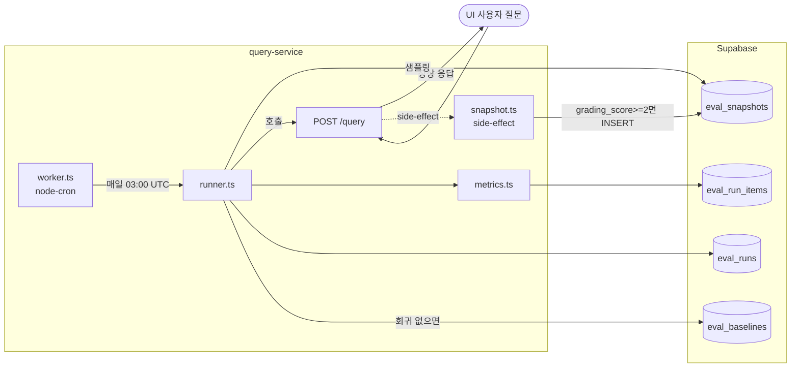

# Evaluation 완전 자동화 (백그라운드 서비스) 설계 문서

**작성일:** 2026-04-17
**대상 프로젝트:** insurance-qa-agent
**관련 스펙:** `2026-04-17-eval-auto-seeding.md` (본 스펙이 대체)
**JD 매핑:** LLMOps 운영 고도화 (주요 업무), AI 서비스 운영 (필수)

---

## 문제

이전 스펙(`2026-04-17-eval-auto-seeding.md`)은 "수작업 없이 자동 씨딩"을 목표로 했지만 여전히 다음을 요구했다.

- 사용자가 `bash scripts/eval.sh --seed`를 실행
- 사용자가 `bash scripts/eval.sh`를 실행
- 사용자가 `bash scripts/eval.sh --update-baseline`을 실행

**Railway 같은 PaaS에 배포한 뒤에는 스크립트 실행 자체가 불가능하다.** 서버에 접속해서 bash를 돌리는 건 운영 패턴이 아니다. 모든 eval 동작이 **백엔드에서 백그라운드로 알아서 돌아야 한다**.

---

## 해결

Evaluation을 **query-service 내부의 백그라운드 서브시스템**으로 통합한다. 파일 기반 상태(golden.json, baseline.json, results/)를 전부 Supabase로 이전하여 stateless 배포 환경에서도 동작하게 한다.

**세 가지 자동화 트리거**

1. **씨딩 (side-effect)** — `/query` 요청 처리 시 side-effect로 자동 snapshot 적재
2. **eval 실행 (cron)** — node-cron으로 하루 1회 자동 실행
3. **baseline 갱신 (auto-approve)** — 첫 실행 결과가 자동 baseline, 이후는 policy 기반 승격

**사용자 동선: 0 steps.** UI에서 평소처럼 질의만 하면 나머지는 서버가 알아서 처리.

---

## 변경 범위

| 파일 | 변경 |
|---|---|
| `query-service/src/eval/snapshot.ts` | 신규 — `/query` 핸들러에서 호출되는 side-effect 씨딩 로직 |
| `query-service/src/eval/worker.ts` | 신규 — 백그라운드 cron 실행기 |
| `query-service/src/eval/supabase-repo.ts` | 신규 — eval 관련 Supabase CRUD |
| `query-service/src/eval/runner.ts` | 수정 — 파일 I/O 제거, Supabase 기반으로 변경 |
| `query-service/src/eval/metrics.ts` | 유지 (핵심 로직) |
| `query-service/src/eval/report.ts` | 삭제 (콘솔 리포트 불필요, 로그로 대체) |
| `query-service/src/eval/cli.ts` | 삭제 |
| `query-service/src/eval/dataset/golden.json` | 삭제 |
| `query-service/src/eval/types.ts` | 수정 (Supabase 스키마 반영) |
| `query-service/src/index.ts` | 수정 — /query 핸들러에 snapshot side-effect, 시작 시 worker 기동 |
| `query-service/package.json` | 수정 — `node-cron` 의존성 추가, `eval` 스크립트 제거 |
| `scripts/eval.sh` | 삭제 |
| `docs/eval/` 디렉토리 | 삭제 (baseline.json, results/, README.md) |
| `supabase/migrations/NNN_eval_tables.sql` | 신규 — 4개 테이블 DDL |
| `k8s/query-service/deployment.yaml` | 수정 — `EVAL_CRON_ENABLED`, `EVAL_CRON_SCHEDULE` env 추가 |
| `.gitignore` | 수정 — `docs/eval/results/*` 엔트리 제거 (디렉토리 자체 삭제) |

---

## 아키텍처



---

## Supabase 스키마

### `eval_snapshots` — 씨드 스냅샷

실사용 질의가 side-effect로 누적되는 베이스라인 소스.

```sql
create table eval_snapshots (
  id uuid primary key default gen_random_uuid(),
  question_hash text not null unique,
  question text not null,
  user_id uuid not null,
  document_id uuid not null,
  category text not null,
  baseline_answer text not null,
  baseline_citations jsonb not null,
  baseline_retrieved_clauses jsonb not null,
  baseline_grader_score int not null,
  source_trace_id text,
  created_at timestamptz not null default now()
);
create index on eval_snapshots (category);
create index on eval_snapshots (created_at desc);
```

- `question_hash`: 질문 텍스트의 SHA-256 8자리 prefix. 중복 씨딩 방지.
- unique constraint로 race condition에서도 중복 안 됨.

### `eval_runs` — 실행 이력

각 eval 실행의 집계 결과.

```sql
create table eval_runs (
  id uuid primary key default gen_random_uuid(),
  run_id text not null unique,
  started_at timestamptz not null,
  finished_at timestamptz,
  status text not null, -- 'running' | 'completed' | 'failed'
  dataset_size int not null default 0,
  aggregate jsonb, -- {faithfulness, answer_relevance, context_precision, answer_consistency, citation_stability}
  by_category jsonb,
  has_regression boolean default false,
  error text
);
create index on eval_runs (started_at desc);
```

### `eval_run_items` — 실행별 per-item 결과

```sql
create table eval_run_items (
  id uuid primary key default gen_random_uuid(),
  run_id text not null references eval_runs(run_id) on delete cascade,
  snapshot_id uuid not null references eval_snapshots(id) on delete cascade,
  answer text,
  retrieved_clauses jsonb,
  scores jsonb not null,
  error text,
  created_at timestamptz not null default now()
);
create index on eval_run_items (run_id);
```

### `eval_baselines` — 승인된 baseline

```sql
create table eval_baselines (
  id uuid primary key default gen_random_uuid(),
  run_id text not null references eval_runs(run_id),
  aggregate jsonb not null,
  by_category jsonb not null,
  approved_at timestamptz not null default now(),
  approved_by text not null default 'auto' -- 'auto' | 'manual'
);
create index on eval_baselines (approved_at desc);
```

현재 baseline = `select * from eval_baselines order by approved_at desc limit 1`.

---

## 트리거 1: Snapshot side-effect (씨딩 자동화)

### 동작

`/query` 핸들러 응답 직전에 비동기로 호출. 응답 지연 없도록 await 없이 fire-and-forget + 에러 catch.

```typescript
// index.ts 핸들러 내부
// ... graph.invoke 완료 후 ...
void captureSnapshot({ // fire-and-forget
  question,
  userId,
  documentId,
  answer: result.answer,
  citations: result.citations,
  retrievedClauses: result.retrievedClauses,
  questionType: result.questionType,
  gradingScore: result.gradingScore,
  traceId: trace?.id,
}).catch((err) => console.error("[snapshot] failed:", err));

return c.json({ ... });
```

### 조건

- `gradingScore >= 2` (저품질 baseline 배제)
- `x-eval-run-id` 헤더 없음 (eval 자체의 호출은 씨딩 제외, 순환 방지)
- `question_hash` 기준 기존 row 없음 (unique constraint + ON CONFLICT DO NOTHING)

### Category

`output.questionType` 재사용 (`coverage` | `claim_eligibility` | `general`).

---

## 트리거 2: 백그라운드 cron (eval 자동 실행)

### 구현

`node-cron`을 query-service 프로세스 내부에서 기동.

```typescript
// worker.ts
import cron from "node-cron";
import { runEvaluation } from "./runner.js";

export function startEvalWorker(): void {
  const enabled = process.env.EVAL_CRON_ENABLED !== "false";
  const schedule = process.env.EVAL_CRON_SCHEDULE ?? "0 3 * * *"; // 매일 03:00 UTC

  if (!enabled) {
    console.log("[eval-worker] disabled via EVAL_CRON_ENABLED=false");
    return;
  }

  cron.schedule(schedule, async () => {
    console.log("[eval-worker] scheduled run starting");
    try {
      const result = await runEvaluation({ sampleSize: 20 });
      console.log("[eval-worker] complete:", result.run_id, result.aggregate);
    } catch (err) {
      console.error("[eval-worker] failed:", err);
    }
  });

  console.log(`[eval-worker] scheduled: ${schedule}`);
}
```

### 기동

```typescript
// index.ts
serve({ fetch: app.fetch, port }, () => {
  console.log(`Query service running on :${port}`);
  startEvalWorker();
});
```

### 환경변수

| 변수 | 기본값 | 설명 |
|---|---|---|
| `EVAL_CRON_ENABLED` | `true` | `false`로 worker 비활성화 (로컬 dev에서 유용) |
| `EVAL_CRON_SCHEDULE` | `0 3 * * *` | cron 표현식 |
| `EVAL_SAMPLE_SIZE` | `20` | 매 실행당 sampling할 snapshot 수 |

### 샘플링 전략

- 전체 스냅샷에서 카테고리별 비율 유지하며 random sampling
- `EVAL_SAMPLE_SIZE`만큼 선택 (기본 20)
- 너무 많으면 cron 실행 시간 길어짐 + Anthropic 비용 증가
- 샘플 크기가 snapshot 총량보다 많으면 전체 사용

---

## 트리거 3: Baseline 자동 승급

### 정책

1. **Bootstrap (첫 실행)**: `eval_baselines`가 비어있으면, 첫 `eval_runs` 완료 즉시 자동으로 baseline 등록 (`approved_by='auto'`)
2. **Regression 없음**: 매 run의 결과가 baseline 대비 모든 메트릭 5% 이내면 자동으로 baseline 갱신 (`approved_by='auto'`). 점수가 개선된 상태를 새 baseline으로 삼아 계속 drift를 얕게 유지
3. **Regression 있음**: baseline 유지, `eval_runs.has_regression = true`로 기록. 알림 발송 (Phase 2에서 Slack/이메일 연동)

이 정책이 과하면 `EVAL_AUTO_PROMOTE_BASELINE=false`로 끄고 수동(SQL UPDATE) 승급 가능.

---

## 새 메트릭 세트 (스펙 v2 계승)

**유지**
1. Faithfulness (LLM judge)
2. Answer Relevance (embedding)
3. Context Precision (LLM judge)
4. Answer Consistency — 현재 답변 vs `baseline_answer` 임베딩 유사도
5. Citation Stability — 현재 retrieved vs `baseline_retrieved_clauses` Jaccard

Context Recall 제거 (ground truth 의존).

---

## On-demand 트리거 (선택, Phase 2)

Phase 1 범위 제외. 필요하면 추후 추가:

- `POST /admin/eval/run` — 수동 실행 트리거 (X-Internal-Token 필요)
- `POST /admin/eval/baselines/:run_id/promote` — 수동 baseline 승급

CLI/스크립트는 없다. 모두 내부 API 호출 기반.

---

## UI (선택, Phase 2 또는 별도 스펙)

Phase 1 범위 제외. `/admin/eval` 페이지는 추후 별도 스펙으로 다룬다. 당장은 Supabase Studio에서 `eval_runs` 테이블을 직접 조회.

---

## Railway 배포 시나리오

### 배포 구성

- query-service 프로세스가 HTTP 서버 + cron worker를 모두 담당 (단일 서비스)
- 별도 cron 서비스 불필요 (`node-cron`이 in-process)
- Railway 재시작 시 다음 cron tick부터 자동 재개
- 프로세스 crash → Railway auto-restart → cron 스케줄 재등록

### 실패 시나리오 대응

- Anthropic API 장애: eval run이 `status=failed`로 종료, 다음 cron에서 재시도
- Supabase 장애: snapshot side-effect 실패(로그만), 다음 질의부터 재개
- Langfuse 장애: snapshot은 영향 없음 (Supabase로 직접 저장)

### 관측

모든 주요 이벤트는 `console.log` → Railway 로그로 수집:
- `[snapshot] inserted: <hash>`
- `[eval-worker] scheduled: 0 3 * * *`
- `[eval-worker] scheduled run starting`
- `[eval-worker] complete: <run_id> {scores}`
- `[eval-worker] regression detected: <run_id>`

Phase 2에서 Grafana Cloud로 구조화 로그 전송 가능.

---

## 설계 결정

### 왜 snapshot을 Supabase에 저장하는가 (Langfuse API 아님)

이전 스펙은 Langfuse API에서 trace를 조회해 씨딩했다. 하지만:
1. Langfuse API는 외부 SaaS라 SLA/장애 전파됨
2. trace retention 정책에 묶임 (자유 플랜은 30일)
3. `retrieved_clauses` 같은 필드가 이전 trace엔 없어 backfill 필요

Supabase 직접 저장은:
- 우리 시스템의 1급 데이터 (retention 완전 제어)
- schema 진화 자유 (컬럼 추가 등)
- snapshot side-effect로 실시간 적재 → Langfuse 없어도 동작

Langfuse는 여전히 런타임 관측(tag, score)으로 사용. 역할 분리.

### 왜 in-process cron (node-cron)인가 (Railway cron 아님)

- Railway의 별도 cron 서비스를 쓰면 배포 단위가 분리돼 복잡도 ↑
- node-cron은 Railway/Docker/k8s 어디서도 동일하게 동작
- 단일 프로세스이므로 배포/재시작 시 상태 일관성 자연스러움
- 분산 환경이 되면 (replica>1) leader election 필요. 현재 replica=1이라 문제없음

### 왜 응답 경로와 snapshot을 async/fire-and-forget으로 분리하는가

- 사용자 응답 지연 최소화 (snapshot DB write는 사용자에게 의미 없음)
- snapshot 실패해도 사용자 경험에 영향 없음
- 단, 실패는 반드시 로그로 남겨 누락 감지 가능

### 왜 Auto-promote baseline인가

수동 승급이 가장 안전하지만, 운영 환경에서는 "매번 사람이 결정"이 병목. 정책 기반 자동 승급으로 drift를 얕게 유지하고, 회귀 시에만 멈춰서 baseline을 고정. 필요 시 env로 끌 수 있게 설계.

### 왜 파일 기반(JSON)을 전부 버리는가

- 컨테이너/Railway에서 파일 mutation은 ephemeral (재배포 시 소실)
- 파일 편집이 배포와 분리돼 race 위험
- Supabase는 이미 쓰고 있는 데이터 스토어이므로 추가 의존성 0
- `baseline.json`을 git tracked로 유지해도 되지만, 수동 승급 불가능 → 결국 Supabase 필수

### 왜 category를 `questionType`으로 고정하는가

현재 classifier 노드가 3개 카테고리(`coverage`/`claim_eligibility`/`general`)만 산출. 이걸 재사용하면 사용자 개입 없이 자동 분류. 추후 카테고리 세분화가 필요하면 classifier를 확장하면 되고, eval은 그대로 따라감.

---

## 검증 기준

1. **Zero manual steps** — 사용자가 UI에서 질의만 하면 snapshot이 Supabase `eval_snapshots`에 적재됨
2. **Zero manual steps** — 설정한 시각(기본 03:00 UTC)에 자동으로 eval 실행, `eval_runs`에 row 추가됨
3. **Bootstrap** — `eval_baselines` 비어있을 때 첫 eval run 완료 시 자동으로 baseline 등록됨
4. **회귀 감지** — baseline 대비 5% 이상 하락 시 `has_regression=true`, baseline 유지
5. **개선 감지** — 5% 이내 유지 또는 개선 시 `has_regression=false`, baseline 자동 갱신
6. **순환 방지** — eval 자체의 query 호출(`X-Eval-Run-Id` 포함)은 snapshot으로 적재되지 않음
7. **비동기 분리** — snapshot 실패가 /query 응답 시간/에러에 영향 없음
8. **로컬 dev** — `EVAL_CRON_ENABLED=false`로 cron 비활성화 가능, snapshot side-effect도 같은 변수로 끌 수 있음
9. **Railway 배포** — 별도 스크립트/수동 개입 없이 배포만으로 전체 자동화 동작
10. **관측** — Railway 로그만 보면 언제 eval이 실행됐고 점수가 얼마였는지 확인 가능

---

## 마이그레이션

### 삭제 대상 (이전 스펙 산출물)

- `query-service/src/eval/cli.ts`
- `query-service/src/eval/report.ts`
- `query-service/src/eval/dataset/golden.json`
- `query-service/src/eval/dataset/` 디렉토리
- `scripts/eval.sh`
- `docs/eval/baseline.json`
- `docs/eval/README.md`
- `docs/eval/results/` 디렉토리
- `docs/eval/` 디렉토리 (비워지면 제거)

### 수정 대상

- `query-service/src/eval/types.ts` — Supabase row 타입으로 재정의
- `query-service/src/eval/runner.ts` — 파일 I/O 제거, Supabase repo 사용
- `query-service/src/eval/metrics.ts` — Context Recall 제거, Answer Consistency/Citation Stability 추가
- `query-service/src/index.ts` — snapshot side-effect + worker 기동
- `query-service/package.json` — `eval` script 제거, `node-cron` 추가
- `.gitignore` — `docs/eval/*` 엔트리 제거

### 신규

- `query-service/src/eval/snapshot.ts`
- `query-service/src/eval/worker.ts`
- `query-service/src/eval/supabase-repo.ts`
- `supabase/migrations/NNN_eval_tables.sql`
- `k8s/query-service/deployment.yaml` (env 추가)

### 이전 스펙 처리

`2026-04-17-evaluation-pipeline.md`와 `2026-04-17-eval-auto-seeding.md`는 deprecated 표기로 유지 (설계 결정 이력 추적).
