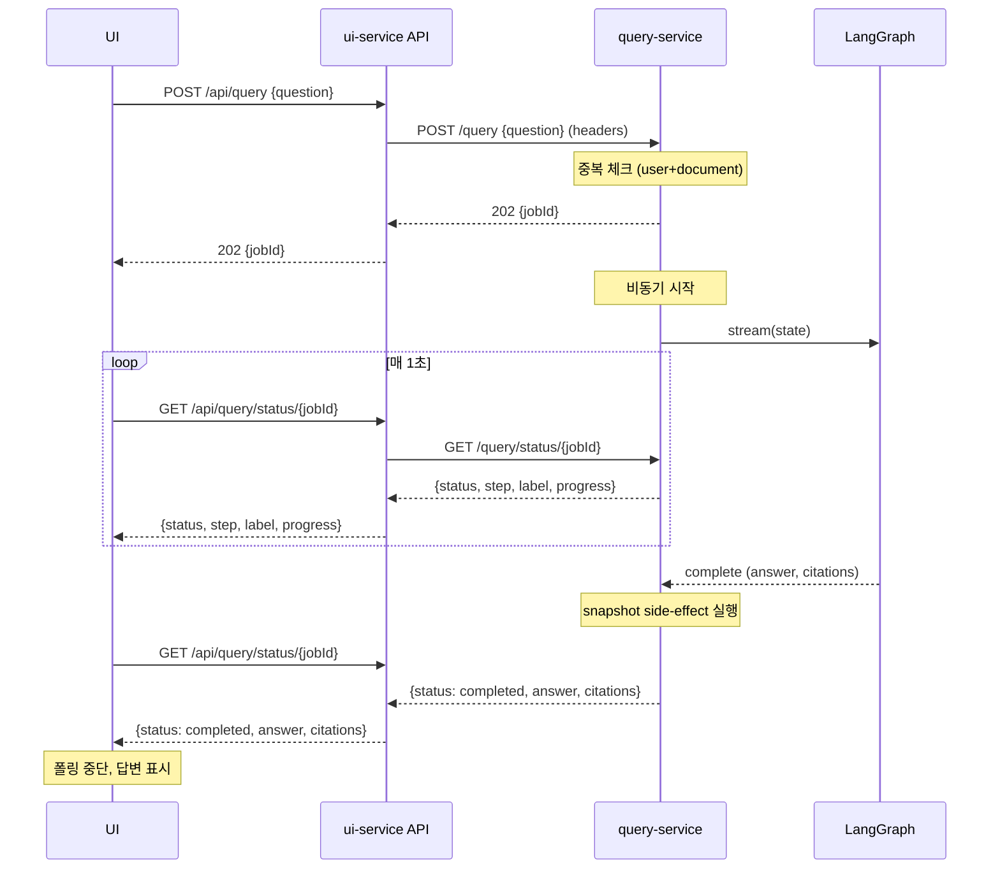

# 쿼리 진행 상태 표시 + 중복 요청 방지 설계 문서

**작성일:** 2026-04-17
**대상 프로젝트:** insurance-qa-agent
**JD 매핑:** 시스템 아키텍처 설계 (우대), AI 서비스 운영 (필수)

---

## 문제

현재 `/query` 플로우는 두 가지 이슈가 있다.

### 이슈 1: 중복 요청 보호 없음

- ui-service → `/api/query` → query-service `/query`는 동기 HTTP
- 처리 시간이 5~15초 (LangGraph self-correction 루프 포함)
- 그 사이 사용자가 다시 전송하면 병렬로 또 다른 LangGraph 실행 트리거
- HTTP라 WebSocket처럼 서버가 연결 상태를 관리하지 않음
- 사용자가 빠르게 여러 번 누르면 Anthropic 비용 폭증 + Supabase 중복 INSERT 가능

### 이슈 2: 진행 상태 불투명

- 현재 UI는 "약관 분석 중..." 정적 스피너만 표시
- 사용자는 15초 동안 무엇이 진행되는지 알 수 없음 → 체감 대기 시간이 실제보다 훨씬 길게 느껴짐
- 파일 업로드엔 ProgressBar로 단계별 진행 표시가 있는데 쿼리는 없음 — 일관성 부족
- LangGraph는 이미 classifier → retriever → answer_generator → grader → (rewriter) → citation_formatter로 단계가 나뉘어 있으므로, 이 정보를 UI에 전달 가능

---

## 해결

**두 가지를 함께 해결한다.**

1. **비동기 + 폴링 패턴 도입** — POST `/query`는 jobId만 즉시 반환하고, GET `/query/status/:jobId`를 클라이언트가 1초 간격으로 폴링. 기존 ingestion(`/ingest/status/{jobId}`) 패턴과 동일
2. **단계별 진행 상태 공개** — LangGraph의 각 노드 실행 시 in-memory job registry를 업데이트, 폴링 응답에 현재 단계 + 사용자 친화적 라벨 포함
3. **중복 요청 방지** — 클라이언트 버튼 비활성화 + 서버 in-flight 체크(409 반환)

**왜 SSE/WebSocket이 아닌 폴링인가**
- 프로젝트 기존 패턴(ingestion)과 동일 유지
- Next.js API route로 SSE 프록시보다 단순
- 1초 지연은 이 UX에서 무시 가능
- ARCHITECTURE.md에 이미 명시된 설계 결정

---

## 변경 범위

### query-service

| 파일 | 변경 |
|---|---|
| `src/jobs/query-jobs.ts` | 신규 — in-memory job registry + TTL cleanup |
| `src/graph/stream.ts` | 신규 — graph.stream() 래퍼, 노드 이벤트를 job에 반영 |
| `src/index.ts` | 수정 — POST /query 비동기화, GET /query/status/:jobId 추가, 중복 방지 체크 |
| `src/eval/snapshot.ts` | 수정 — 호출 위치가 동기 응답 경로에서 백그라운드 완료 핸들러로 이동 |

### ui-service

| 파일 | 변경 |
|---|---|
| `app/api/query/route.ts` | 수정 — 동기 → 비동기 (jobId 반환) |
| `app/api/query/status/[jobId]/route.ts` | 신규 — 폴링 프록시 |
| `app/components/QueryProgress.tsx` | 신규 — ProgressBar 스타일 단계 표시 컴포넌트 |
| `app/dashboard/.../ChatPanel*.tsx` | 수정 — 폴링 로직, 입력 잠금, QueryProgress 통합 |
| `app/context/AppContext.tsx` | 수정 (가능성) — isQueryInFlight 상태 관리 |

---

## 비동기 플로우



---

## Job Registry (in-memory)

`query-service/src/jobs/query-jobs.ts`

```typescript
export type QueryJobStatus =
  | "queued"
  | "running"
  | "completed"
  | "failed";

export interface QueryJob {
  jobId: string;
  userId: string;
  documentId: string;
  question: string;
  status: QueryJobStatus;
  currentStep: string;           // LangGraph 노드명 (e.g., "retriever")
  progressIndex: number;         // 0 ~ TOTAL_STEPS
  totalSteps: number;
  result?: {
    answer: string;
    citations: Citation[];
    retrieved_clauses: RetrievedClauseSnapshot[];
    questionType: EvalCategory;
    gradingScore: number;
  };
  error?: string;
  startedAt: number;             // Date.now()
  completedAt?: number;
}

class JobRegistry {
  private jobs = new Map<string, QueryJob>();
  private TTL_MS = 5 * 60 * 1000;

  create(input): QueryJob { ... }
  get(jobId): QueryJob | null { ... }
  update(jobId, patch): void { ... }
  findInFlight(userId, documentId): QueryJob | null {
    // status가 queued 또는 running인 가장 최근 job
  }
  startCleanup(): void {
    // setInterval로 매 1분마다 완료 후 TTL 지난 job 제거
  }
}

export const queryJobs = new JobRegistry();
```

**왜 in-memory인가**
- `replica=1` 전제 (Railway에서도 유지 예정)
- Supabase에 쓰면 오버엔지니어링 — job은 분 단위로 휘발되어도 무방
- 재시작 시 진행 중 job은 잃지만 사용자가 재전송하면 해결

**제약**
- 프로세스 재시작 시 진행 중 폴링은 404 → 클라이언트는 "전송 실패"로 처리
- replica>1이 되면 별도 설계 필요 (이번 스펙 범위 밖)

---

## Graph Streaming

LangGraph.js는 `graph.stream(input, { streamMode: "updates" })`로 각 노드 실행 시 `{nodeName: partialState}` yield.

`query-service/src/graph/stream.ts`

```typescript
export async function runGraphWithProgress(
  graph: CompiledGraph,
  input: GraphInput,
  onNode: (nodeName: string) => void
): Promise<GraphOutput> {
  let finalState: GraphOutput | null = null;

  for await (const chunk of graph.stream(input, { streamMode: "updates" })) {
    for (const [nodeName, partial] of Object.entries(chunk)) {
      onNode(nodeName);
      // 마지막 노드의 상태를 final로 저장
      finalState = { ...(finalState ?? input), ...(partial as object) };
    }
  }

  if (!finalState) throw new Error("Graph produced no updates");
  return finalState as GraphOutput;
}
```

**노드 → 라벨 매핑** (`query-service/src/jobs/step-labels.ts`)

| 노드 | 라벨 | progressIndex |
|---|---|---|
| `question_classifier` | "질문 유형 분석 중" | 1 |
| `retriever` | "관련 조항 검색 중" | 2 |
| `tools_agent` | "청구 자격 확인 중" | 3 (optional) |
| `answer_generator` | "답변 생성 중" | 4 |
| `grader` | "답변 품질 평가 중" | 5 |
| `query_rewriter` | "검색 재시도 중" | — (progressIndex 유지) |
| `citation_formatter` | "근거 정리 중" | 6 |

`totalSteps`는 **질문 유형에 따라 동적으로 결정**한다.

- 초기: classifier 완료 전이므로 `totalSteps = null` (UI는 indeterminate 상태 표시)
- classifier 완료 후 `questionType` 결정되면:
  - `claim_eligibility`: totalSteps = 6 (tools_agent 경유)
  - `coverage` / `general`: totalSteps = 5

UI에서는 `totalSteps`가 `null`인 동안 무진행 스피너(indeterminate), 결정된 이후 `progressIndex / totalSteps * 100`%로 채움. classifier는 무조건 1이고 그 뒤 단계는 유형별로 다름.

**재시도(rewriter) 처리**
- grader가 저점수로 rewriter로 돌아갈 때 progressIndex는 roll-back하지 않고 유지
- 대신 label을 "검색 재시도 중 (N회차)"로 표시
- 사용자가 "다시 돌고 있다"는 것을 인지하되 바가 역주행하지 않게

---

## API 변경

### POST /query (query-service)

**Before:**
```http
POST /query
{"question": "..."}
→ 200 {"answer": "...", "citations": [...], ...}
```

**After:**
```http
POST /query
{"question": "..."}
→ 202 {"jobId": "qj-<uuid>"}
→ 409 {"error": "in-flight", "jobId": "<existing>"} (중복)
```

202 응답 후 비동기로 graph 실행. snapshot side-effect는 완료 시점에 실행.

### GET /query/status/:jobId (query-service, 신규)

```http
GET /query/status/qj-abc123
→ 200 {
  "jobId": "qj-abc123",
  "status": "running",
  "currentStep": "retriever",
  "stepLabel": "관련 조항 검색 중",
  "progressIndex": 2,
  "totalSteps": 6
}

→ 200 {
  "jobId": "qj-abc123",
  "status": "completed",
  "stepLabel": "완료",
  "progressIndex": 6,
  "totalSteps": 6,
  "result": {
    "answer": "...",
    "citations": [...],
    "questionType": "coverage"
  }
}

→ 404 (만료 또는 존재하지 않음)
```

### ui-service API 라우트

- `app/api/query/route.ts` — 프록시만 수정 (헤더 전달은 그대로)
- `app/api/query/status/[jobId]/route.ts` — 신규 프록시

---

## 프론트엔드 UX

### 중복 요청 방지 (클라이언트)

ChatPanel 컴포넌트:

```typescript
const [activeJobId, setActiveJobId] = useState<string | null>(null);
const isInFlight = activeJobId !== null;

// 전송 핸들러
async function handleSend(question: string) {
  if (isInFlight) return; // guard
  const { jobId } = await fetch("/api/query", { ... }).then(r => r.json());
  setActiveJobId(jobId);
}

// 입력/버튼
<textarea disabled={isInFlight} ... />
<button disabled={isInFlight}>
  {isInFlight ? "전송 중..." : "전송"}
</button>
```

### 폴링 + 진행 상태

```typescript
useEffect(() => {
  if (!activeJobId) return;

  const interval = setInterval(async () => {
    const res = await fetch(`/api/query/status/${activeJobId}`);
    if (res.status === 404) {
      setError("요청이 만료되었습니다");
      setActiveJobId(null);
      return;
    }
    const data = await res.json();
    setProgress(data);

    if (data.status === "completed") {
      appendMessage({ role: "assistant", content: data.result.answer, ... });
      setActiveJobId(null);
      setProgress(null);
    } else if (data.status === "failed") {
      setError(data.error);
      setActiveJobId(null);
      setProgress(null);
    }
  }, 1000);

  return () => clearInterval(interval);
}, [activeJobId]);
```

### QueryProgress 컴포넌트 (신규)

```
┌───────────────────────────────────────┐
│  관련 조항 검색 중 (2/6)               │
│  ▓▓▓▓░░░░░░░░░░░░  33%               │
└───────────────────────────────────────┘
```

- 파일 업로드의 ProgressBar 디자인 언어 재사용 (Tailwind 토큰 동일)
- `stepLabel` 크게 표시 + 진행률 바
- `progressIndex / totalSteps * 100`으로 % 계산
- 회전 아이콘 대신 이동하는 프로그레스 바로 "무언가 진행 중"을 시각화

---

## 서버 측 중복 방지

`POST /query`에서:

```typescript
const existing = queryJobs.findInFlight(userId, documentId);
if (existing) {
  return c.json({ error: "query in flight", jobId: existing.jobId }, 409);
}
```

**409 응답 처리 (클라이언트):**
- 같은 jobId로 폴링 재개 (이미 떠 있는 다른 탭의 요청을 받아내기)
- 토스트 알림: "이전 질의가 아직 처리 중입니다"

---

## Snapshot side-effect 이동

**현재:** `/query` 핸들러 내부에서 `graph.invoke` 완료 후 `void captureSnapshot(...)`

**변경:** 비동기 flow에서는 graph.stream이 끝나는 지점에서 호출

```typescript
// 비동기 실행 함수
async function runQueryJob(job: QueryJob, langfuseTrace: ...): Promise<void> {
  try {
    const result = await runGraphWithProgress(graph, input, (nodeName) => {
      queryJobs.update(job.jobId, mapNodeToProgress(nodeName));
    });

    queryJobs.update(job.jobId, { status: "completed", result, completedAt: Date.now() });

    // snapshot side-effect (기존 로직 유지)
    if (!job.evalRunId) {
      void captureSnapshot({...}).catch(err => console.error("[snapshot] failed:", err));
    }
  } catch (err) {
    queryJobs.update(job.jobId, { status: "failed", error: String(err) });
  }
}
```

---

## Eval runner 영향

`query-service/src/eval/runner.ts`가 `/query`를 호출하는 방식을 약간 바꿔야 함.

**Before (동기):**
```typescript
const resp = await fetch("/query", { ... });
const { answer, citations, retrieved_clauses } = await resp.json();
```

**After (비동기 + 폴링):**
```typescript
const { jobId } = await postQuery(...);
const result = await pollUntilComplete(jobId);
```

Runner에 `pollUntilComplete` 헬퍼 추가. 폴링은 동일하게 1초 간격, 타임아웃 120초.

---

## 설계 결정

### 왜 replica=1 in-memory가 충분한가

- Railway에서도 replica=1 유지 예정 (JD 매핑 메모리 참조)
- job 정보는 분 단위로 휘발되어도 UX에 큰 타격 없음 (사용자가 재전송하면 해결)
- Supabase에 쓰는 건 오버엔지니어링 + 폴링마다 DB 히트 → 비용 증가

### 왜 409 응답 + 기존 jobId 반환인가

- 클라이언트가 어떤 이유로 상태를 잃어도(새로고침 등) 서버의 진실을 따라 복구 가능
- 다중 탭에서도 동일 job을 바라보게 되어 일관성 유지

### 왜 질문 유형별 동적 totalSteps인가

- 질문 유형에 따라 tools_agent는 건너뛸 수 있음
- 고정 6으로 통일하면 `coverage` 질문은 tools_agent 슬롯을 건너뛰어 바가 jump → 이상하게 보임
- 대신 classifier 완료 후 totalSteps를 확정 (5 or 6) → 바 진행이 선형, 사용자가 "x/y" 정확한 정보 획득
- classifier 이전까지 짧은 indeterminate 구간은 자연스러움 (모든 판단의 전제이므로)

### 왜 rewriter에서 progressIndex를 롤백하지 않는가

- 바가 역주행하면 "뭔가 꼬였다"는 인상
- 대신 label로 "재시도 중"임을 명시 → 시간이 더 걸리지만 정상 흐름이라는 메시지

### 왜 ingestion 처럼 Supabase에 저장하지 않는가

- ingestion은 수 분 단위 오래 걸려 재기동 복원력이 필요
- query는 최대 30초 내외 → 재기동 복구가 필요 없음
- 폴링 부하가 Supabase에 직접 가는 것을 막기 위해 in-memory로 유지

---

## 검증 기준

1. UI에서 질문 전송 시 202 + jobId 즉시 반환
2. 전송 직후 입력창/버튼 비활성화, 버튼 라벨 "전송 중..." 표시
3. 연속 클릭/전송 시도 시 추가 요청 발생하지 않음 (클라이언트 guard)
4. 서버에서 같은 user+document의 in-flight 요청이 있으면 409 + 기존 jobId 반환
5. 1초 간격 폴링으로 단계 라벨이 순차적으로 업데이트됨 ("질문 유형 분석 중" → "관련 조항 검색 중" → ...)
6. progressIndex가 역주행하지 않음 (rewriter 진입 시에도 유지)
7. 완료 시 answer + citations를 폴링 응답에서 받아 채팅에 추가
8. snapshot side-effect가 동기 플로우와 동일하게 (비동기 완료 시점에) 실행됨
9. `query-service/src/eval/runner.ts`가 새 비동기 /query와 호환되어 eval cron이 여전히 동작
10. job TTL 5분 경과 후 메모리에서 자동 제거
11. 서버 재시작 중 진행 중 job의 폴링은 404 → 클라이언트가 명확한 에러 메시지 표시

---

## 비범위 (다음 작업)

- SSE 전환 (폴링 → 스트리밍)
- 다중 replica 지원 (Redis pub/sub 또는 Supabase realtime)
- 취소 버튼 (진행 중 요청 중단)
