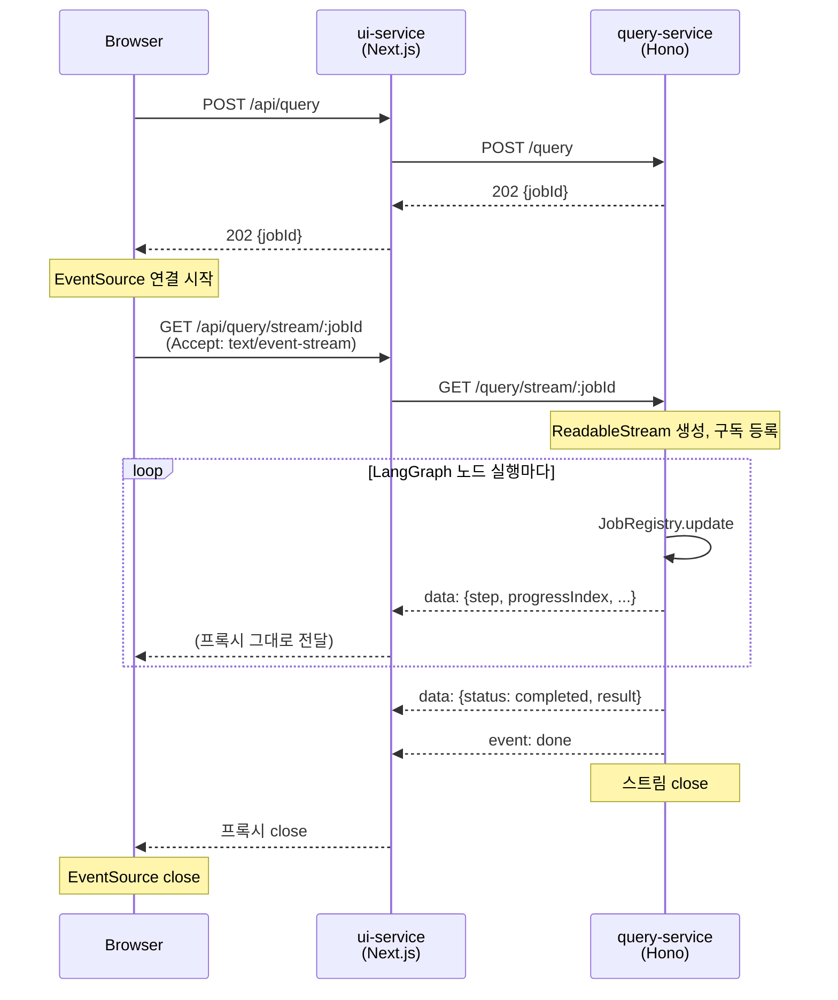

# 쿼리 진행 상태 SSE 전환 설계 문서

**작성일:** 2026-04-17
**대상 프로젝트:** insurance-qa-agent
**관련 스펙:** `2026-04-17-query-progress-ux.md` (폴링 제거로 이 스펙을 대체)
**JD 매핑:** 시스템 아키텍처 설계 (우대)

---

## 문제

이전 스펙으로 도입한 폴링 방식이 리소스를 낭비한다.

- 쿼리 1건 = 30초 × 1초 간격 = **30번의 HTTP 왕복**
- 브라우저 → Next.js edge → ui-service → query-service (4 hop × 30회)
- 각 왕복: 200B 요청 + 300B 응답 ≈ 15KB/쿼리
- Railway 배포 시 대역폭/CPU 낭비, 사용자 기기 배터리/데이터 소모
- 포트폴리오 관점에서도 "실시간 진행 상황을 1초 폴링으로 구현"은 설득력 약함

---

## 해결

**Server-Sent Events (SSE)로 전환.** 단방향 서버→클라이언트 이벤트 스트리밍에 정확히 맞는 표준.

- 쿼리 1건 = **HTTP 연결 1회** (완료 후 닫힘)
- 서버가 상태 변경 시마다 `data: {...}\n\n` push
- 클라이언트는 브라우저 표준 `EventSource` API 사용
- 기존 `GET /query/status/:jobId`는 완전 제거 (단일 경로)

---

## 변경 범위

### query-service

| 파일 | 변경 |
|---|---|
| `src/jobs/query-jobs.ts` | EventEmitter 기반 pub/sub 추가, job 업데이트 시 이벤트 emit |
| `src/index.ts` | `GET /query/status/:jobId` **제거**, `GET /query/stream/:jobId` (SSE) 추가 |
| `src/eval/runner.ts` | 폴링 → SSE 구독으로 변경 |

### ui-service

| 파일 | 변경 |
|---|---|
| `app/api/query/status/[jobId]/route.ts` | **제거** |
| `app/api/query/stream/[jobId]/route.ts` | 신규 — Next.js streaming response로 SSE 프록시 |
| `app/components/ChatPanel.tsx` | 폴링 로직 → `EventSource` 구독으로 교체 |

기존 job registry / QueryProgress 컴포넌트 / queryJobStore / POST /query / 409 중복 가드 / snapshot side-effect는 모두 유지.

---

## 아키텍처



---

## SSE 이벤트 포맷

### 진행 중 (`message` 이벤트, 기본)

```
data: {"status":"running","currentStep":"retriever","stepLabel":"관련 조항 검색 중","progressIndex":2,"totalSteps":5,"questionType":"general","retryCount":0}

```

### 완료 (마지막 `message` + `done` 이벤트)

```
data: {"status":"completed","stepLabel":"완료","progressIndex":5,"totalSteps":5,"result":{...}}

event: done
data: ok

```

### 실패

```
data: {"status":"failed","error":"..."}

event: done
data: error

```

### Heartbeat (30초 idle 대응)

```
:heartbeat

```

SSE는 `:`로 시작하는 줄을 comment로 무시. 프록시 버퍼링 방지 목적. 10초 간격.

---

## JobRegistry 확장

이벤트 pub/sub 추가:

```typescript
import { EventEmitter } from "node:events";

class JobRegistry {
  private jobs = new Map<string, QueryJob>();
  private emitter = new EventEmitter();

  update(jobId: string, patch: Partial<QueryJob>): void {
    const existing = this.jobs.get(jobId);
    if (!existing) return;
    const updated = { ...existing, ...patch };
    this.jobs.set(jobId, updated);
    this.emitter.emit(jobId, updated);
  }

  subscribe(jobId: string, listener: (job: QueryJob) => void): () => void {
    this.emitter.on(jobId, listener);
    return () => this.emitter.off(jobId, listener);
  }

  // 기존 cleanup() 내부에 다음 추가 — TTL 만료 job의 listener 누수 방지
  private cleanup(): void {
    // ... 기존 jobs 만료 로직
    for (const expiredJobId of expiredIds) {
      this.jobs.delete(expiredJobId);
      this.emitter.removeAllListeners(expiredJobId); // ← 신규
    }
  }
}
```

리스너는 terminal state(completed/failed) 수신 시 스스로 unsubscribe.

EventEmitter의 기본 max listeners는 10. replica=1이고 동일 job은 동시 구독자가 적어 충분. 다중 탭에서 하나의 job을 구독할 경우 탭당 1 listener → 실용 범위 내.

---

## query-service SSE 핸들러

Hono `stream` helper 사용:

```typescript
import { stream } from "hono/streaming";

app.get("/query/stream/:jobId", (c) => {
  const jobId = c.req.param("jobId");
  const job = queryJobs.get(jobId);
  if (!job) return c.json({ error: "job not found or expired" }, 404);

  // 헤더는 stream() 호출 전에 설정 (body 시작 후엔 무효)
  c.header("Content-Type", "text/event-stream");
  c.header("Cache-Control", "no-cache");
  c.header("Connection", "keep-alive");
  c.header("X-Accel-Buffering", "no"); // nginx/proxy 버퍼링 방지

  return stream(c, async (s) => {
    // Promise + resolver — setInterval 폴링 대신 이벤트 기반 종료
    let resolveDone: () => void;
    const donePromise = new Promise<void>((r) => { resolveDone = r; });

    // 1. 먼저 구독해서 race window 제거
    const unsubscribe = queryJobs.subscribe(jobId, async (updated) => {
      await s.write(formatEvent(updated)).catch(() => {});
      if (updated.status === "completed" || updated.status === "failed") {
        await s.write("event: done\ndata: ok\n\n").catch(() => {});
        unsubscribe();
        resolveDone();
      }
    });

    // 2. 그다음 현재 스냅샷 전송 (구독 후 update가 즉시 와도 유실 없음)
    //    progressIndex는 단조 증가라 동일 단계 중복 전송돼도 클라이언트 idempotent
    const current = queryJobs.get(jobId);
    if (current) {
      await s.write(formatEvent(current));
      if (current.status === "completed" || current.status === "failed") {
        await s.write("event: done\ndata: ok\n\n");
        unsubscribe();
        resolveDone!();
      }
    }

    // 3. heartbeat (10초)
    const heartbeat = setInterval(() => {
      s.write(":heartbeat\n\n").catch(() => clearInterval(heartbeat));
    }, 10_000);

    // 4. 클라이언트 abort 시 정리
    c.req.raw.signal.addEventListener("abort", () => {
      unsubscribe();
      clearInterval(heartbeat);
      resolveDone!();
    });

    await donePromise;
    clearInterval(heartbeat);
  });
});
```

**에지 케이스**
- 구독 시점에 이미 completed 상태: subscribe→snapshot read 순서라 race 없음, 즉시 done 전송
- 클라이언트 abort: unsubscribe + heartbeat clear + Promise resolve로 stream 종료
- subscribe 후 snapshot 사이 update: 동일 단계가 두 번 전송될 수 있으나 progressIndex/status가 멱등이라 무해

---

## ui-service Next.js SSE 프록시

Next.js App Router는 `Response`를 streaming으로 반환 가능.

```typescript
// app/api/query/stream/[jobId]/route.ts
export async function GET(
  req: NextRequest,
  { params }: { params: Promise<{ jobId: string }> }
) {
  const { jobId } = await params;

  const supabase = await createClient();
  const { data: { user } } = await supabase.auth.getUser();
  if (!user) return NextResponse.json({ error: "unauthorized" }, { status: 401 });

  const queryUrl = process.env.QUERY_API_URL;
  const upstream = await fetch(`${queryUrl}/query/stream/${jobId}`, {
    headers: {
      "X-Internal-Token": process.env.INTERNAL_AUTH_TOKEN ?? "",
      Accept: "text/event-stream",
    },
    signal: req.signal,
  });

  if (upstream.status === 404) {
    return NextResponse.json({ error: "job not found or expired" }, { status: 404 });
  }
  if (!upstream.ok || !upstream.body) {
    return NextResponse.json({ error: "upstream error" }, { status: upstream.status });
  }

  // 완료 시 assistant 메시지 저장 로직
  const documentId = getJobDocumentId(jobId);
  const decoder = new TextDecoder();
  let buffer = ""; // SSE 이벤트는 \n\n 경계 — chunk가 경계 가운데서 잘릴 수 있어 버퍼 필요

  const transform = new TransformStream<Uint8Array, Uint8Array>({
    async transform(chunk, controller) {
      // 1. 패스스루 (브라우저 SSE 흐름은 즉시)
      controller.enqueue(chunk);

      // 2. 버퍼에 쌓고 \n\n 경계로 이벤트 단위 파싱
      buffer += decoder.decode(chunk, { stream: true });
      let idx: number;
      while ((idx = buffer.indexOf("\n\n")) !== -1) {
        const raw = buffer.slice(0, idx);
        buffer = buffer.slice(idx + 2);

        const dataLine = raw.split("\n").find((l) => l.startsWith("data: "));
        if (!dataLine) continue;
        const json = dataLine.slice(6);
        if (json === "ok" || json === "error") continue;

        try {
          const data = JSON.parse(json);
          if (data.status === "completed" && data.result && documentId && markAssistantSaved(jobId)) {
            await supabase.from("messages").insert({
              document_id: documentId,
              user_id: user.id,
              role: "assistant",
              content: data.result.answer,
              citations: data.result.citations ?? [],
            });
          }
        } catch (err) {
          console.error(`[stream-route] ${jobId}: parse/save failed:`, err);
        }
      }
    },
  });

  return new Response(upstream.body.pipeThrough(transform), {
    headers: {
      "Content-Type": "text/event-stream",
      "Cache-Control": "no-cache, no-transform",
      "Connection": "keep-alive",
      "X-Accel-Buffering": "no",
    },
  });
}
```

**버퍼 파싱 핵심**
- TCP/HTTP chunk 경계는 SSE 이벤트 경계와 무관 — 한 이벤트가 두 chunk로 쪼개지거나 두 이벤트가 한 chunk에 묶여 옴
- `decoder.decode(chunk, { stream: true })`로 UTF-8 멀티바이트 잘림도 안전 처리
- 패스스루를 먼저 enqueue해서 브라우저 진행 표시는 지연 없음, 저장은 백그라운드

---

## ChatPanel 수정

```typescript
useEffect(() => {
  if (!activeJobId) return;

  const es = new EventSource(`/api/query/stream/${activeJobId}`);
  const cleanCloseRef = { current: false }; // 클린 close 플래그 — onerror 오탐 방지
  const timeout = setTimeout(() => {
    cleanCloseRef.current = true;
    es.close();
    setMessages((prev) => [...prev, {
      role: "assistant",
      content: "응답이 지연되고 있어요. 잠시 후 다시 시도해주세요.",
      timestamp: new Date(),
    }]);
    setActiveJobId(null);
  }, 60_000); // 전역 timeout

  const finish = (cleanup: () => void) => {
    cleanCloseRef.current = true;
    clearTimeout(timeout);
    es.close();
    cleanup();
  };

  es.onmessage = (event) => {
    const data = JSON.parse(event.data);

    if (data.status === "completed" && data.result) {
      const citations = data.result.citations ?? [];
      finish(() => {
        setMessages((prev) => [...prev, {
          role: "assistant",
          content: data.result.answer,
          citations,
          timestamp: new Date(),
        }]);
        setCitations(citations);
        setActiveJobId(null);
      });
      return;
    }

    if (data.status === "failed") {
      finish(() => {
        setMessages((prev) => [...prev, {
          role: "assistant",
          content: "오류가 발생했습니다. 잠시 후 다시 시도해주세요.",
          timestamp: new Date(),
        }]);
        setActiveJobId(null);
      });
      return;
    }

    setProgress({
      stepLabel: data.stepLabel ?? "처리 중",
      progressIndex: data.progressIndex ?? 0,
      totalSteps: data.totalSteps ?? null,
    });
  };

  es.addEventListener("done", () => {
    cleanCloseRef.current = true;
    clearTimeout(timeout);
    es.close();
  });

  es.onerror = () => {
    // 클린 close 후에도 onerror가 fire될 수 있음 → ref로 구분
    if (cleanCloseRef.current) return;
    cleanCloseRef.current = true;
    clearTimeout(timeout);
    es.close();
    setMessages((prev) => [...prev, {
      role: "assistant",
      content: "연결이 끊어졌습니다. 다시 시도해주세요.",
      timestamp: new Date(),
    }]);
    setActiveJobId(null);
  };

  return () => {
    cleanCloseRef.current = true;
    clearTimeout(timeout);
    es.close();
  };
}, [activeJobId, setMessages, setCitations]);
```

**EventSource auto-reconnect 주의**
- 브라우저는 연결 끊기면 3초 후 재연결 시도
- terminal 상태 후 즉시 `close()` + `cleanCloseRef`로 재연결 방지 및 onerror 오탐 차단
- React state는 클로저에 캡처돼 stale → 동기 mutable ref로 클린 close 추적

---

## Eval runner 수정

기존 pollUntilComplete를 SSE 구독으로 변경.

```typescript
async function callQueryService(snapshot, runId): Promise<QueryResponse> {
  // 1. 비동기 시작 (기존과 동일)
  const { jobId } = await postQuery(...);

  // 2. SSE 구독
  const url = `${baseUrl}/query/stream/${jobId}`;
  return new Promise((resolve, reject) => {
    const timeout = setTimeout(() => reject(new Error("timeout")), 120_000);

    fetch(url, {
      headers: { "X-Internal-Token": token, Accept: "text/event-stream" },
    }).then(async (res) => {
      if (!res.body) throw new Error("no body");
      const reader = res.body.getReader();
      const decoder = new TextDecoder();
      let buffer = "";

      while (true) {
        const { done, value } = await reader.read();
        if (done) break;
        buffer += decoder.decode(value, { stream: true });

        // SSE 파싱: \n\n 경계로 event 분리
        let idx;
        while ((idx = buffer.indexOf("\n\n")) !== -1) {
          const raw = buffer.slice(0, idx);
          buffer = buffer.slice(idx + 2);

          const dataLine = raw.split("\n").find(l => l.startsWith("data: "));
          if (!dataLine) continue;
          const json = dataLine.slice(6);
          if (json === "ok" || json === "error") continue;

          const data = JSON.parse(json);
          if (data.status === "completed" && data.result) {
            clearTimeout(timeout);
            resolve(data.result);
            return;
          }
          if (data.status === "failed") {
            clearTimeout(timeout);
            reject(new Error(data.error ?? "failed"));
            return;
          }
        }
      }
    }).catch(reject);
  });
}
```

Node 20+는 네이티브 fetch + ReadableStream 지원. `EventSource`는 브라우저 전용이라 Node에서는 수동 파싱.

---

## 설계 결정

### 왜 기존 폴링 엔드포인트를 완전 제거하는가

- 두 경로 유지는 "폴백 인프라" 관리 부담 (eval runner, 클라이언트 모두 분기)
- SSE가 Railway/Node 환경에서 안정적 — 폴백 가정 없음
- Next.js streaming response도 안정 지원
- 단일 경로가 스펙/코드 모두 단순

### 왜 pub/sub인가 (순수 함수 호출 아님)

- SSE 핸들러는 비동기로 오래 열려있음 → 이벤트가 발생할 때마다 write 해야 함
- JobRegistry.update가 어디서 호출되든(executeQueryJob 내부) SSE 핸들러는 동일 emitter로 수신
- 핸들러와 job 실행이 decouple

### 왜 heartbeat 10초인가

- Railway/Cloudflare 등 typical idle timeout > 30초
- 10초 간격이면 안전하고 트래픽 부담 없음 (comment 1줄)

### 왜 eval runner는 EventSource 아닌 수동 파서인가

- Node.js 표준 `EventSource`가 없음 (브라우저 전용). 폴리필 패키지 추가하는 것은 무거움
- 수동 파싱: `\n\n` 경계만 잡으면 되어 30줄 이내로 구현 가능
- fetch + ReadableStream은 Node 18+ 네이티브

### 왜 snapshot side-effect는 그대로 유지되는가

- snapshot은 `executeQueryJob` 내부에서 graph 완료 시 호출됨
- SSE는 진행 상태 전달 레이어만 담당 — 서비스 로직 변경 없음

---

## 검증 기준

1. 쿼리 1건당 **HTTP 연결 1회**로 모든 진행 상태 수신
2. 브라우저 DevTools Network 탭에서 `stream/:jobId` 1개 연결만 표시
3. 단계 라벨이 실제 노드 실행 시점에 맞춰 즉시 push됨 (폴링 지연 1초 없음)
4. 완료 시 `event: done` 수신 후 클라이언트가 EventSource 자동 close
5. 클라이언트가 새로고침/닫기 시 server-side unsubscribe + heartbeat clear 실행 (리소스 누수 없음)
6. 30초 idle에도 connection 유지 (heartbeat comment로 proxy timeout 방지)
7. 다중 탭에서 동일 jobId 구독 시 모든 탭이 동일 이벤트 수신
8. `GET /query/status/:jobId` 완전 제거 확인 (404 반환)
9. eval runner가 SSE로 완료 대기하여 기존 cron eval 동작 유지
10. 409 in-flight → 기존 jobId로 SSE 연결 복귀 시 즉시 현재 상태 스냅샷 이벤트 수신

---

## 비범위

- ingestion-service SSE 전환 (Go Fiber 기반, 별도 작업으로 진행)
- WebSocket 전환 (단방향 유스케이스라 불필요)
- Multi-replica SSE 확산 (pub/sub broker 필요, 현재 query-service replica=1 전제)
- ui-service replica 확장 시 `markAssistantSaved` 분산 dedup (현재 ui-service replica=1 전제, 확장 시 Supabase unique constraint 등 필요)

---

## 검토 이력

| 날짜 | 변경 |
|---|---|
| 2026-04-18 | 자체 검토로 9개 이슈 식별 후 수정: TransformStream 버퍼 파서, subscribe-snapshot race 제거, Hono 헤더 시점, Promise resolver 기반 done 대기, JobRegistry cleanup listener 누수, ChatPanel cleanCloseRef + 60s timeout, ui-service replica 비범위 명시 |
